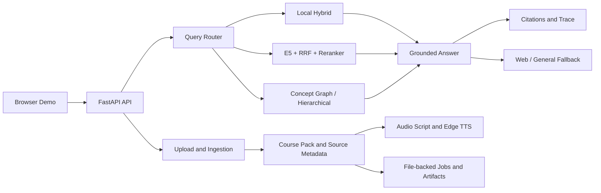

# CourseBee v2

[](https://github.com/YuMinBee/CourseBee/actions/workflows/ci.yml)

> 여러 강의자료를 하나의 Course Pack으로 구성하고, 출처 기반 질의응답과 AI 오디오 학습 콘텐츠를 생성하는 RAG 학습 서비스

CourseBee는 단일 PDF 처리 도구였던 BeePDF를 다중 문서 학습 서비스로 확장한 프로젝트입니다. PDF, PPTX, Markdown, TXT 자료를 강의 단위로 누적하고, 질문 유형에 맞는 검색 경로를 선택해 근거와 함께 답변합니다. 자료에서 근거를 찾지 못하면 그 사실을 먼저 알리고 웹 검색 또는 일반지식 폴백을 명시적으로 구분합니다.

| 구분 | 내용 |
| --- | --- |
| 핵심 흐름 | 자료 추가 → Course Pack 구성 → 검색/라우팅 → 출처 기반 답변 → AI Audio Overview |
| 검색 | Local hybrid, multilingual E5, RRF, Cross-Encoder reranking, concept graph-assisted retrieval |
| 백엔드 | FastAPI, Pydantic, SSE, background jobs, file-backed artifacts |
| 운영 기반 | Docker, GitHub Actions, health/readiness checks, request trace, atomic writes |
| 검증 | 자동화 테스트 121개 및 검색·일반화·견고성 평가 스위트 |
| 현재 상태 | Local-first portfolio demo, production-shaped architecture |

기술 선택 기준은 명확한 문제와 검증 가능한 효과입니다. 각 검색 단계에 비교 가능한 baseline과 fallback을 두고, 정확도·지연시간·실패 경로를 evaluation과 trace로 확인합니다.


> 위 이미지는 외부 Vector DB를 포함한 확장 방향까지 표현합니다. 현재 데모의 의미 검색은 프로세스 내부에서 실행되며, Course Pack 메타데이터와 생성 결과는 로컬 파일에 저장됩니다. 외부 Vector DB와 Object Storage는 운영 확장 단계입니다.

## Problem

강의 복습은 문서 한 개가 아니라 여러 주차와 차시를 함께 탐색해야 합니다. 이 과정에서는 다음 문제가 발생합니다.

- 정확한 단어가 다른 의역·교차 언어 질문은 키워드 검색만으로 찾기 어렵습니다.
- 일반 LLM 답변은 실제 강의자료에 없는 내용을 근거처럼 제시할 수 있습니다.
- 문서가 늘어나면 답변이 어느 파일과 페이지에서 나왔는지 추적하기 어렵습니다.
- 문서 처리와 오디오 생성은 시간이 걸리므로 진행 상태와 실패 원인을 확인할 수 있어야 합니다.

CourseBee는 검색 품질뿐 아니라 출처 보존, 실패 처리, 관측 가능성을 하나의 사용자 흐름 안에서 다루는 것을 목표로 합니다.

## User Flow

1. 사용자가 PDF, PPTX, Markdown, TXT 자료를 추가합니다.
2. 기존 자료를 유지한 채 Course Pack에 새 문서를 누적합니다.
3. 문서를 chunk로 나누고 `doc_id`, `filename`, `page`, `chunk_id` 등의 출처 메타데이터를 보존합니다.
4. 질문을 분류하고 local hybrid, semantic, graph, hierarchical 검색 중 적절한 경로를 선택합니다.
5. 선택된 근거로 답변을 생성하고 문장별 출처와 retrieval trace를 제공합니다.
6. 자료에 근거가 없으면 웹 근거 또는 일반지식 폴백임을 답변에 표시합니다.
7. 선택한 Course Pack을 바탕으로 대화형 스크립트와 음성 파일을 생성합니다.

현재 브라우저 데모는 **자료 관리, grounded chat, AI Audio Overview**에 집중합니다. Study Kit, Summary, Concept Map API는 구현되어 있지만 UI에서는 완성된 기능부터 공개하기 위해 숨겨 두었습니다.

## Why These Technologies

### AI and RAG

| Technology | Why it was needed | How it is used | Evidence / trade-off |
| --- | --- | --- | --- |
| Local hybrid retrieval | 모델이나 API 없이도 실행되는 재현 가능한 baseline과 장애 시 fallback이 필요했습니다. | lexical score에 한국어 정규화와 character feature를 결합합니다. | 평균 warm latency `2.29ms`; 의역·교차 언어 Recall@3는 `0.17`로 한계도 확인했습니다. |
| Multilingual E5 + RRF | 키워드가 다른 의역과 한국어 문서에 대한 영문 질문을 찾기 어려웠습니다. | E5 dense ranking과 lexical ranking을 RRF로 합쳐 exact match와 semantic match를 함께 보존합니다. | Recall@3 `0.17 → 1.00`, MRR `0.167 → 0.917`; 평균 warm latency `9.09ms`입니다. |
| Cross-Encoder reranking | embedding 검색은 관련 문서를 찾더라도 최종 순서가 불안정할 수 있습니다. | top candidate만 query-document pair로 다시 점수화합니다. | MRR `0.917 → 1.000`; 평균 warm latency는 `9.09ms → 12.03ms`로 증가했습니다. |
| Query router | 사실, 관계, 전체 개요 질문은 필요한 context 범위가 서로 다릅니다. | 질문을 분류해 chunk, concept graph, hierarchical summary 경로를 선택합니다. | Synthetic evaluation에서 router `10/10`, graph useful case `4/4`를 통과했습니다. |
| Concept graph-assisted retrieval | 선수 개념과 개념 간 관계는 유사한 문장 검색만으로 설명하기 어렵습니다. | concept edge와 evidence chunk를 함께 반환해 관계형 질문의 근거를 보강합니다. | 전체 GraphRAG 제품을 표방하지 않고 Course Pack 내부의 설명 가능한 관계 검색으로 범위를 제한했습니다. |
| Source grounding and citation check | LLM이 자료에 없는 내용을 강의 근거처럼 답하는 문제를 막아야 했습니다. | 답변에 문장별 citation을 연결하고, API로 보정한 summary가 grounding check에 실패하면 source-grounded rule output으로 복구합니다. | Source recall `9/9`, citation coverage `0.90`, no-context abstention `1/1`입니다. |
| Web RAG + explicit general fallback | 자료에 없는 질문을 무조건 거절하면 학습 흐름이 끊깁니다. | Course Pack → cited web evidence → labeled general knowledge 순서로 시도합니다. | `answer_scope`와 `grounding_status`로 근거 범위를 구분하고 일반지식 답변에는 자료 citation을 만들지 않습니다. |
| Ollama / managed LLM providers | 로컬 재현성과 외부 모델의 생성 품질을 모두 지원하기 위해 생성 로직과 공급자를 분리했습니다. | provider interface 뒤에서 local Ollama와 optional OpenAI-compatible API를 교체합니다. | API key 없이도 실행할 수 있으며 오디오 응답에 원본 글자 수, 최소 목표, 길이 보정 상태를 기록합니다. |
| Edge TTS | 검색 결과를 읽는 데서 끝내지 않고 실제 학습 산출물까지 연결하고자 했습니다. | grounded dialogue script를 두 화자의 mp3 artifact로 생성합니다. | 현재 UI에서 완성된 Studio 기능인 AI Audio Overview만 노출합니다. |

검색 수치는 한국어 의역과 영문 질문이 포함된 6개 synthetic case의 단일 프로세스 warm benchmark이며, 모델 다운로드와 외부 LLM 응답 시간은 제외합니다.

### Backend and Operations

| Technology | Why it was needed | How it is used | Current boundary |
| --- | --- | --- | --- |
| FastAPI + Pydantic | 업로드, 검색, 생성 작업의 계약과 오류를 명확하게 유지해야 했습니다. | typed request/response schema와 자동 OpenAPI 문서를 제공합니다. | 단일 API 프로세스를 기준으로 구현되어 있습니다. |
| SSE streaming | 검색과 생성 중 빈 화면을 줄이고 사용자가 요청을 취소할 수 있어야 했습니다. | status, token, result, error event를 순서대로 전송하고 연결 해제를 감지합니다. | HTTP integration test로 event 순서와 최종 결과를 검증합니다. |
| Background job state | 다중 문서 ingestion은 즉시 끝나지 않으므로 진행률과 실패 상태가 필요했습니다. | `queued → running → succeeded/failed` 상태와 조회 API를 제공합니다. | FastAPI background task 기반이며 재시작을 견디는 durable queue는 운영 확장 항목입니다. |
| Request trace | RAG 실패가 분류, 검색, 폴백 중 어디서 발생했는지 확인해야 했습니다. | request ID, stage latency, candidate/selected chunk, graph edge, fallback을 응답에 남깁니다. | 중앙 trace backend 없이 요청 단위로 관측 가능한 단계입니다. |
| Atomic writes and upload validation | 중간 파일 손상, 경로 이탈, 과도한 업로드를 막아야 했습니다. | 임시 파일 교체, identifier/path/signature/size/count 검증을 적용합니다. | 사용자 인증, malware scan, tenant quota는 운영 확장 항목입니다. |
| Docker + GitHub Actions | 개발 환경 밖에서도 같은 패키지와 컨테이너가 실행되는지 증명해야 했습니다. | non-root image, health/readiness check, test/package/container CI를 실행합니다. | 현재는 배포 자동화가 아니라 재현 가능한 배포 단위까지 검증합니다. |

> 외부 Vector DB, Object Storage, 영속 작업 큐, 중앙 관측 시스템은 아직 실제 적용 기술로 계산하지 않습니다. 현재 구조에서 교체 가능한 운영 확장 대상으로만 문서화했습니다.

## Runtime Architecture



검색 컴포넌트는 provider 경계로 분리되어 있습니다.

```text
RetrieverProvider
├─ LexicalRetriever           # exact lexical baseline
├─ HybridRetriever            # lexical + Korean character features
├─ EmbeddingRetriever         # multilingual E5 dense retrieval
└─ SemanticHybridRetriever
   ├─ Reciprocal Rank Fusion  # lexical + dense ranking
   └─ Cross-Encoder           # optional candidate reranking
```

모델이 없거나 semantic 검색이 실패하면 local hybrid로 복구하고, 실제 실행 경로와 폴백 여부를 `retrieval_details`와 `trace.retrieval_debug`에 기록합니다.

## Evaluation

### Semantic Retrieval

한국어 의역과 영문 질문이 포함된 6개 synthetic case에서 동일한 top-3 조건으로 비교했습니다.

| Mode | Recall@3 | MRR | Mean warm latency |
| --- | ---: | ---: | ---: |
| Local hybrid | 0.17 | 0.167 | 2.29 ms |
| E5 + RRF | 1.00 | 0.917 | 9.09 ms |
| E5 + RRF + Cross-Encoder | 1.00 | 1.000 | 12.03 ms |

재정렬 경로는 local hybrid보다 평균 약 9.7ms 느렸지만, 실험 케이스의 Recall@3를 `0.17 → 1.00`, MRR을 `0.167 → 1.000`으로 개선했습니다.

### Quality and Robustness

| Suite | Result |
| --- | ---: |
| Query router | 10 / 10 |
| Required source recall@5 | 9 / 9 |
| Citation coverage | 0.90 |
| Multi-domain generalization | 6 / 6 |
| OCR/conflict/distractor/abstention robustness | 5 / 5 |
| Local ask latency p50 / p95 | 9.97 ms / 13.51 ms |

평가는 공개 가능한 synthetic fixture를 사용합니다. Semantic latency는 모델 다운로드를 제외한 단일 프로세스 warm 측정값이며, 외부 LLM/TTS 응답 시간이나 운영 환경 SLA를 의미하지 않습니다.

- [Core evaluation report](eval/results/latest_eval.md)
- [Semantic retrieval report](eval/results/latest_semantic_retrieval_eval.md)
- [Generalization report](eval/results/latest_generalization_eval.md)
- [Robustness report](eval/results/latest_robustness_eval.md)

## Tech Stack

| Area | Technology |
| --- | --- |
| API | Python, FastAPI, Pydantic, Uvicorn |
| Streaming | Server-Sent Events with cancellation handling |
| Document processing | PyMuPDF, Tesseract OCR, PDF/PPTX/TXT/Markdown ingestion |
| Retrieval | lexical scoring, Korean character features, multilingual E5, RRF, Cross-Encoder |
| RAG | source-grounded generation, sentence citation, web/general fallback, concept graph routing |
| AI providers | local Ollama, optional OpenAI-compatible API, Wikipedia Web RAG |
| Audio | staged dialogue script generation, dual-voice Edge TTS |
| Storage | local JSON/artifact store, atomic file replacement |
| Quality | unittest/HTTP integration tests, Ruff, evaluation harnesses |
| Delivery | Docker/Compose, GitHub Actions, isolated wheel verification |

## Quick Start

### Local

```bash
python -m venv .venv
python -m pip install -e ".[pdf,tts,dev]"
coursebee --reload --port 8000
```

Optional semantic retrieval:

```bash
python -m pip install -e ".[pdf,tts,semantic,dev]"
python eval/run_semantic_retrieval_eval.py
```

Open:

```text
Demo     http://127.0.0.1:8000/demo
Swagger  http://127.0.0.1:8000/docs
Health   http://127.0.0.1:8000/health
Ready    http://127.0.0.1:8000/ready
```

`/demo`를 처음 열면 공개 synthetic NLP Course Pack이 자동 생성됩니다. 브라우저의 `Add Source`에서 직접 자료를 추가할 수도 있습니다.

### Docker

```bash
docker compose up --build
```

Semantic 모델을 이미지에 포함하려면 빌드 전에 `COURSEBEE_INSTALL_SEMANTIC=true`를 설정합니다. 모델 가중치는 첫 semantic 요청에서 내려받고 이후 프로세스와 embedding cache에서 재사용합니다.

## Configuration

| Variable | Purpose | Default |
| --- | --- | --- |
| `COURSEBEE_DATA_ROOT` | Course Pack과 artifact 저장 위치 | `outputs` |
| `COURSEBEE_API_KEY` | `/v2/*` 요청의 선택적 `X-API-Key` 보호 | empty |
| `COURSEBEE_MAX_UPLOAD_BYTES` | 파일당 업로드 제한 | 25 MB |
| `COURSEBEE_MAX_UPLOAD_BATCH_BYTES` | 요청당 전체 업로드 제한 | 100 MB |
| `COURSEBEE_MAX_UPLOAD_FILES` | 요청당 파일 수 제한 | 20 |
| `COURSEBEE_EMBEDDING_MODEL` | semantic embedding model | `intfloat/multilingual-e5-small` |
| `COURSEBEE_RERANKER_MODEL` | Cross-Encoder reranker | `cross-encoder/mmarco-mMiniLMv2-L12-H384-v1` |
| `OLLAMA_BASE_URL` / `OLLAMA_MODEL` | local LLM provider | local Ollama / `gemma2:2b` |
| `OPENAI_API_KEY` / `OPENAI_MODEL` | optional managed LLM provider | empty / `gpt-5.4-mini` |

전체 설정은 [.env.example](.env.example)에서 확인할 수 있습니다. 비밀값은 저장소에 커밋하지 않습니다.

## Main API

| Method | Endpoint | Purpose |
| --- | --- | --- |
| `POST` | `/v2/course-packs/upload` | 브라우저 파일 업로드와 Course Pack 생성/추가 |
| `POST` | `/v2/course-packs/jobs` | 파일 경로 기반 ingestion job 생성 |
| `GET` | `/v2/course-packs/jobs/{job_id}` | 진행률과 실패 상태 조회 |
| `GET` | `/v2/course-packs/{pack_id}` | Course Pack과 source metadata 조회 |
| `POST` | `/v2/course-packs/ask` | 출처 기반 질의응답 |
| `POST` | `/v2/course-packs/ask/stream` | SSE 기반 스트리밍 질의응답 |
| `POST` | `/v2/course-packs/audio-script` | Course Pack 기반 대화 스크립트 생성 |
| `POST` | `/v2/course-packs/tts` | 대화 스크립트와 음성 artifact 생성 |
| `GET` | `/v2/course-packs/{pack_id}/artifacts` | 생성 결과 상태 조회 |

Summary, Study Kit, Concept Map 등 전체 API는 실행 후 `/docs`에서 확인할 수 있습니다.

## Reliability and Operations

- `/health`: 프로세스 liveness 확인
- `/ready`: 데이터 디렉터리 쓰기와 패키지 asset 확인
- `X-Request-ID`: 요청 상관관계 추적
- `X-Process-Time-Ms`: HTTP 처리 시간 확인
- answer `trace`: 라우팅, 단계별 latency, 선택된 chunk/graph edge, fallback 기록
- upload validation: 확장자, 파일 signature, 크기, 개수, identifier와 경로 검증
- non-root container: UID `10001`로 실행
- CI: 정적 검사, 테스트, 3개 평가 suite, wheel 설치, container smoke test

## Scope and Production Path

현재 저장소는 핵심 RAG 동작을 비용 없이 재현하는 local-first 데모입니다. 구현된 범위와 운영 전환 항목을 구분합니다.

| Current | Production upgrade |
| --- | --- |
| in-process semantic retrieval and cache | persisted Vector DB and distributed cache |
| local JSON and file artifacts | relational DB and Object Storage |
| FastAPI background task | durable queue and worker service |
| optional API key | user identity, tenant authorization, quota/rate limit |
| request headers and answer trace | centralized logs, metrics and OpenTelemetry |
| single-instance local state | stateless API and horizontally scalable workers |

따라서 현재 상태를 운영 완료 서비스가 아니라 **production-shaped, not production-deployed**로 정의합니다. 자세한 경계와 교체 전략은 [Production Readiness](docs/PRODUCTION_READINESS.md)에 정리했습니다.

## Project Evolution

| Area | BeePDF v1 | CourseBee v2 |
| --- | --- | --- |
| Main unit | Single PDF | Multi-document Course Pack |
| Focus | PDF-to-audio cloud backend | Retrieval quality and grounded learning flow |
| Retrieval | Single-document RAG | Hybrid, semantic, graph and hierarchical routing |
| Provenance | page/chunk within one file | document/page/chunk across multiple files |
| Operations | request tracking, cache, object storage/DB design | job state, request trace, CI, container and evaluation |
| Output | script and TTS centered | grounded chat and AI Audio Overview centered |

v1의 클라우드 백엔드와 요청 처리 경험을 바탕으로, v2에서는 검색 정확도와 답변 신뢰성을 측정 가능한 문제로 확장했습니다. v1 상세 내용은 [Legacy Overview](docs/V1_LEGACY.md)에서 확인할 수 있습니다.

## Repository Guide

```text
v2/api/                 FastAPI routes and schemas
v2/providers/           LLM, OCR, semantic retrieval and web providers
v2/rag/                 chunking, retrieval, answering and citation checks
v2/assets/              packaged browser demo
eval/                   retrieval, generalization and robustness benchmarks
tests/                  unit and HTTP end-to-end tests
docs/                   architecture and production upgrade notes
```

## Validation

```bash
python -m ruff check v2 eval tests
python -m unittest discover -s tests -v
python eval/run_eval.py
python eval/run_generalization_eval.py
python eval/run_robustness_eval.py
```

GitHub Actions는 push와 pull request마다 동일한 검사와 wheel/container smoke test를 실행합니다.

## Documentation

- [Architecture](docs/ARCHITECTURE.md)
- [Semantic Retrieval](docs/SEMANTIC_RETRIEVAL.md)
- [Evaluation](docs/EVALUATION.md)
- [Citation and Grounding](docs/CITATION_GROUNDING.md)
- [Providers](docs/PROVIDERS.md)
- [Production Readiness](docs/PRODUCTION_READINESS.md)
- [CourseBee v2 Case Study](docs/coursebee-v2-case-study.md)
- [All Documentation](docs/README.md)
