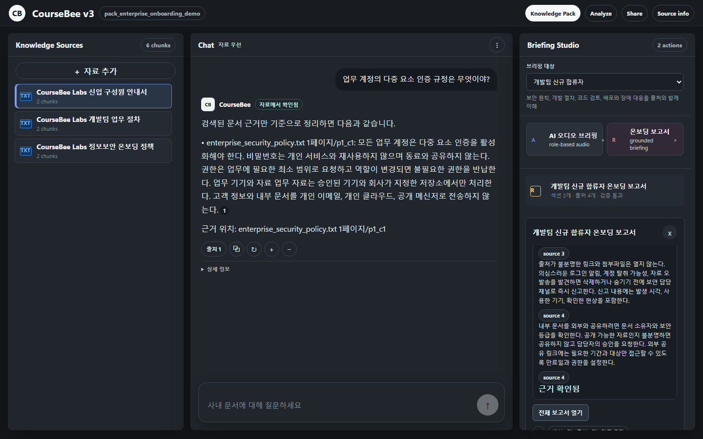
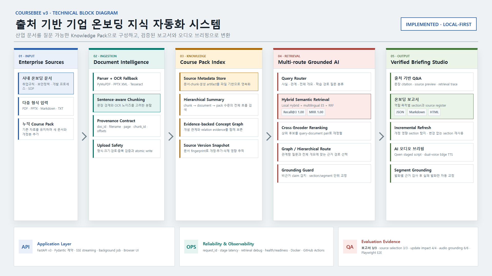
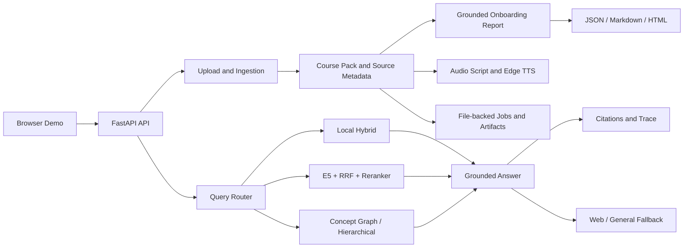

# CourseBee v3

[](https://github.com/YuMinBee/CourseBee/actions/workflows/ci.yml)

> 흩어진 사내 문서를 하나의 Knowledge Pack으로 구성하고, 출처 기반 온보딩 보고서·질의응답·AI 오디오 브리핑을 생성하는 지식 자동화 서비스

CourseBee는 단일 PDF 처리 도구였던 BeePDF와 다중 문서 학습 서비스 v2를 거쳐, 기업 온보딩 문서를 실제 산출물로 변환하는 v3로 확장한 프로젝트입니다. PDF, PPTX, Markdown, TXT 자료를 Knowledge Pack에 누적하고, 같은 검색 근거로 질문에 답하거나 직무별 온보딩 보고서와 오디오 브리핑을 생성합니다. 자료에서 근거를 찾지 못하면 그 사실을 먼저 알리고 웹 검색 또는 일반지식 폴백을 명시적으로 구분합니다.

| 구분 | 내용 |
| --- | --- |
| 핵심 흐름 | 사내 문서 추가 → Knowledge Pack 구성 → 검색/라우팅 → 온보딩 보고서·답변·오디오 |
| 검색 | Local hybrid, multilingual E5, RRF, Cross-Encoder reranking, concept graph-assisted retrieval |
| 백엔드 | FastAPI, Pydantic, SSE, background jobs, file-backed artifacts |
| 운영 기반 | Docker, GitHub Actions, health/readiness checks, request trace, atomic writes |
| 검증 | 자동화 테스트 128개, Playwright 브라우저 E2E, 5개 품질 평가 스위트 |
| 현재 상태 | Local-first portfolio demo, production-shaped architecture |

v3의 제품 범위는 세 가지입니다. `출처 기반 Q&A`, `직무별 온보딩 보고서`, `동일 근거를 사용하는 오디오 브리핑`에 집중하며 퀴즈와 플래시카드는 공개 UI에서 제외했습니다. 기술 선택 기준은 명확한 문제와 검증 가능한 효과입니다.

## Live Artifacts



| 공개 산출물 | 확인 |
| --- | --- |
| 포트폴리오 프로젝트 보고서 | [A3 2페이지 PDF](docs/reports/coursebee-v3-portfolio-report-ko.pdf) · [1페이지](docs/reports/coursebee-v3-portfolio-report-ko-page-1.png) · [2페이지](docs/reports/coursebee-v3-portfolio-report-ko-page-2.png) · [HTML 원본](docs/reports/coursebee-v3-portfolio-report-ko.html) |
| v3 온보딩 보고서 | [HTML](docs/demo-assets/coursebee-v3-onboarding-report.html) · [Markdown](docs/demo-assets/coursebee-v3-onboarding-report.md) · [JSON](docs/demo-assets/coursebee-v3-onboarding-report.json) · [전체 화면](docs/demo-assets/coursebee-v3-onboarding-report.png) |
| v3 반응형 화면 | [모바일 전체 화면](docs/demo-assets/coursebee-v3-demo-mobile.png) |
| v3 보고서 평가 | [근거·인용·문서 반영 평가](eval/results/latest_onboarding_report_eval.md) |
| v2 장문 오디오 실험 | [MP3 재생/열기 (13분 9초)](docs/demo-assets/coursebee-audio-overview.mp3) |
| 동일 대본 / 근거 내역 | [화자별 transcript](docs/demo-assets/coursebee-audio-overview-transcript.txt) · [segment grounding JSON](docs/demo-assets/coursebee-audio-overview-grounding.json) |

v3 브라우저 데모는 가상의 공개 기업 문서인 인사 안내서, 정보보안 정책, 개발팀 업무 절차로 실행됩니다. 보고서는 목적과 문서 제목을 기준으로 관련 자료를 고른 뒤 섹션별 출처와 grounding 상태를 포함하며 JSON, Markdown, 인쇄 가능한 HTML로 저장됩니다. 고정 평가에서 3개 시나리오, 선택된 6개 섹션이 모두 근거 검사를 통과했고 목적별 출처 선택도 `3/3`, 인용 포함률과 문서 반영률은 각각 `1.00`입니다.

v2의 장문 오디오 실험도 그대로 보존합니다. 공개 synthetic NLP 자료로 `qwen3:14b`가 생성한 대본을 strict grounding guard로 검사해 목표 `6,000자`에 대해 원본 `4,878자`를 자료 기반으로 `6,003자`까지 확장했고, 검사 대상 발화 `35/35` 통과, 비근거 발화 `0개`, 자동 교정 `16개`를 확인한 뒤 dual-voice Edge TTS로 합성했습니다.



현재 구현된 입력, 문서 처리, 검색, grounding, 보고서·오디오 산출물과 검증 계층을 한 장에 정리했습니다. [블록도 HTML 원본](docs/diagrams/coursebee-v3-architecture.html)도 함께 관리합니다. 현재 데모의 의미 검색은 프로세스 내부에서 실행되며, 외부 Vector DB와 Object Storage는 운영 확장 단계입니다.

<details>
<summary>v2 검색 중심 구조도 보기</summary>


위 v2 구조도는 외부 Vector DB를 포함한 확장 방향까지 표현합니다. 실제 적용 기술과 향후 기술은 v3 구조도와 아래 운영 전환 표에서 구분합니다.
</details>

## Problem

기업 온보딩은 문서 한 개로 끝나지 않습니다. 인사 규정, 보안 정책, 직무 매뉴얼, 업무 절차를 함께 이해해야 하며 다음 문제가 발생합니다.

- 문서가 여러 저장소와 파일로 흩어져 신입 구성원이 필요한 규정을 찾기 어렵습니다.
- 교육 담당자가 직무별 온보딩 보고서와 브리핑을 반복해서 작성해야 합니다.
- 일반 LLM은 사내 문서에 없는 절차나 책임을 실제 정책처럼 생성할 수 있습니다.
- 문서가 개정되면 어떤 교육 내용과 출처를 다시 확인해야 하는지 추적하기 어렵습니다.
- 보고서와 오디오 생성은 시간이 걸리므로 진행 상태와 실패 원인을 확인할 수 있어야 합니다.

CourseBee는 단순 문서 요약이 아니라 검색 근거를 보고서 문장과 오디오 발화까지 유지하는 것을 목표로 합니다.

## User Flow

1. 교육 담당자가 사내 PDF, PPTX, Markdown, TXT 자료를 추가합니다.
2. 기존 자료를 유지한 채 Knowledge Pack에 새 문서를 누적합니다.
3. 문서를 chunk로 나누고 `doc_id`, `filename`, `page`, `chunk_id` 등의 출처 메타데이터를 보존합니다.
4. 질문을 분류하고 local hybrid, semantic, graph, hierarchical 검색 중 적절한 경로를 선택합니다.
5. 선택된 근거로 직무별 온보딩 보고서를 만들고 JSON, Markdown, HTML artifact로 저장합니다.
6. 같은 근거로 답변을 생성하고 문장별 출처와 retrieval trace를 제공합니다.
7. 이동·현장 학습이 필요한 경우 동일 Knowledge Pack으로 대화형 오디오 브리핑을 생성합니다.
8. 자료에 근거가 없으면 웹 근거 또는 일반지식 폴백임을 답변에 표시합니다.

현재 브라우저 데모는 **Knowledge Source 관리, grounded chat, 온보딩 보고서, AI 오디오 브리핑**에 집중합니다. 기존 Study Kit, Summary, Concept Map API는 하위 호환을 위해 남아 있지만 v3 UI에서는 제품 범위를 좁히기 위해 숨겼습니다.

## Problem Solving: 긴 오디오 대본 생성

BeePDF v1에서는 Clova Studio에 `최소 60줄`과 `maxCompletionTokens=10000`을 지정하고 프롬프트를 여러 차례 강화했지만, 대본이 목표보다 일찍 끝나는 현상을 안정적으로 해결하지 못했습니다. 더 큰 token 상한은 모델이 사용할 수 있는 최대량일 뿐 최소 출력량을 보장하지 않았고, 줄 수 역시 실제 발화 시간을 나타내는 기준이 아니었습니다. 생성 결과를 그대로 신뢰하는 one-shot 구조라 짧은 응답을 감지하거나 복구할 단계도 없었습니다.

최종 오디오 경로에는 별도의 병목도 있었습니다. v1은 Clova Voice 호출 직전에 전체 대본을 기본 `2,000자`로 잘랐기 때문에, Studio가 더 긴 대본을 만들더라도 기본 설정의 음성 결과에는 반영될 수 없었습니다. 이 문제는 프롬프트만 계속 수정해서는 해결할 수 없는 애플리케이션 구조의 문제였습니다.

### 해결 과정

```text
Course Pack 검색
-> Qwen 대본 생성(target_chars)
-> 길이와 형식 검증
-> 짧으면 검색된 강의자료로 source-grounded 확장
-> 5,000자 이상이면 개요 -> 장면별 생성 -> 최종 정리
-> 화자별 segment 생성
-> segment별 출처 일치율과 수치/모델명 주장 검사
-> 실패한 segment만 source-grounded 문장으로 교정
-> dual-voice Edge TTS 합성
```

- `target_chars`와 최소 허용 길이인 목표의 `90%`를 명시하고, 템플릿과 자료 뒤에서도 최종 길이 조건을 다시 전달합니다.
- 생성 직후 `raw_script_char_count`, `minimum_target_chars`, `length_status`를 기록해 모델의 조기 종료를 관측 가능한 상태로 만듭니다.
- 결과가 짧으면 새로운 내용을 임의로 지어내지 않고 검색된 chunk의 완결된 문장으로 대화를 확장합니다.
- 긴 요청은 한 번에 생성하지 않고 개요, 장면별 대화, 최종 정리 단계로 나눠 context와 길이를 관리합니다.
- 각 발화를 연결된 chunk와 비교하고, strict 모드에서는 기준 미달 발화를 자동 교정한 뒤 전체 대본을 다시 검사합니다.
- TTS는 전체 문자열 하나를 자르지 않고 화자별 segment를 순서대로 합성해 긴 대본과 두 화자를 모두 유지합니다.

### 검증 결과

| 검증 항목 | v1 Clova 경로 | v2 Qwen orchestration |
| --- | --- | --- |
| 길이 요청 | `최소 60줄`, token 상한 | 목표 글자 수와 최소 `90%` 기준 |
| 짧은 응답 처리 | 그대로 사용 | 길이 검사 후 자료 기반 확장 |
| 긴 대본 생성 | one-shot | `5,000자` 이상 staged generation |
| TTS 입력 | 전체 대본을 기본 `2,000자`로 절단 | 화자별 segment 단위 합성 |
| 5분 UI 설정 | 목표 길이 보장 없음 | Qwen 원본 `1,736자` -> 최종 `1,892자`, 19개 대화 구간, estimator 기준 약 5분 15초 |
| 공개 장문 실험 | 기본 오디오 경로는 `2,000자` 상한 | `6,000자` 목표에서 원본 `4,878자` -> 최종 `6,003자`, 38개 발화, Edge TTS 실측 13분 9초 |
| 발화 근거 검증 | 별도 검증 없음 | 검사 대상 `35/35` 통과, 비근거 발화 `0개`, 자동 교정 `16개` |

핵심은 모델 교체만으로 해결했다고 설명하지 않는 것입니다. 실제 검증에서도 `qwen3:14b` 원본은 최소 기준보다 짧았습니다. CourseBee는 LLM 출력을 완성품이 아닌 검증 대상 중간 결과로 취급하고, 길이 측정과 source-grounded repair를 추가해 긴 대본 생성을 안정화했습니다.

## Why These Technologies

### AI and RAG

| Technology | Why it was needed | How it is used | Evidence / trade-off |
| --- | --- | --- | --- |
| Local hybrid retrieval | 모델이나 API 없이도 실행되는 재현 가능한 baseline과 장애 시 fallback이 필요했습니다. | lexical score에 한국어 정규화와 character feature를 결합합니다. | 평균 warm latency `2.29ms`; 의역·교차 언어 Recall@3는 `0.17`로 한계도 확인했습니다. |
| Multilingual E5 + RRF | 키워드가 다른 의역과 한국어 문서에 대한 영문 질문을 찾기 어려웠습니다. | E5 dense ranking과 lexical ranking을 RRF로 합쳐 exact match와 semantic match를 함께 보존합니다. | Recall@3 `0.17 → 1.00`, MRR `0.167 → 0.917`; 평균 warm latency `9.09ms`입니다. |
| Cross-Encoder reranking | embedding 검색은 관련 문서를 찾더라도 최종 순서가 불안정할 수 있습니다. | top candidate만 query-document pair로 다시 점수화합니다. | MRR `0.917 → 1.000`; 평균 warm latency는 `9.09ms → 12.03ms`로 증가했습니다. |
| Query router | 사실, 관계, 전체 개요 질문은 필요한 context 범위가 서로 다릅니다. | 질문을 분류해 chunk, concept graph, hierarchical summary 경로를 선택합니다. | Synthetic evaluation에서 router `10/10`, graph useful case `4/4`를 통과했습니다. |
| Concept graph-assisted retrieval | 선수 개념과 개념 간 관계는 유사한 문장 검색만으로 설명하기 어렵습니다. | concept edge와 evidence chunk를 함께 반환해 관계형 질문의 근거를 보강합니다. | 전체 GraphRAG 제품을 표방하지 않고 Course Pack 내부의 설명 가능한 관계 검색으로 범위를 제한했습니다. |
| Source grounding and citation check | LLM이 자료에 없는 내용을 실제 사내 정책처럼 답하는 문제를 막아야 했습니다. | 답변에 문장별 citation을 연결하고, 생성 결과가 grounding check에 실패하면 source-grounded output으로 복구합니다. | Source recall `9/9`, citation coverage `0.90`, no-context abstention `1/1`입니다. |
| Grounded onboarding report | 문서 요약만으로는 교육 담당자가 출처를 다시 대조해야 했습니다. | 목적에 맞는 문서를 선택하고 문서별 핵심 포인트와 source register를 공유하는 보고서 모델을 만들어 JSON, Markdown, HTML로 export합니다. | 고정 평가 `3/3`, grounded section `6/6`, 목적별 출처 선택 `3/3`, 인용 포함률·문서 반영률 `1.00`입니다. |
| Audio segment grounding guard | 긴 대본은 일부 발화만 자료 밖으로 벗어나도 TTS가 그대로 확정해 버리는 문제가 있습니다. | 발화별 연결 chunk와 lexical claim overlap을 검사하고, 수치·미확인 모델명 및 strict 기준 미달 발화만 자료 문장으로 교정한 뒤 재검사합니다. | 고정 평가 `6/6`, 공개 오디오 검사 대상 발화 `35/35`, unsupported `0`입니다. 문체 품질 평가는 별도 과제로 남깁니다. |
| Web RAG + explicit general fallback | 자료에 없는 질문을 무조건 거절하면 학습 흐름이 끊깁니다. | Course Pack → cited web evidence → labeled general knowledge 순서로 시도합니다. | `answer_scope`와 `grounding_status`로 근거 범위를 구분하고 일반지식 답변에는 자료 citation을 만들지 않습니다. |
| Ollama / managed LLM providers | 로컬 재현성과 외부 모델의 생성 품질을 모두 지원하기 위해 생성 로직과 공급자를 분리했습니다. | provider interface 뒤에서 local Ollama와 optional OpenAI-compatible API를 교체합니다. | API key 없이도 실행할 수 있으며 오디오 응답에 원본 글자 수, 최소 목표, 길이 보정 상태를 기록합니다. |
| Edge TTS | 이동 중이거나 화면을 보기 어려운 상황에서도 온보딩 내용을 소비할 수 있어야 했습니다. | grounded dialogue script를 두 화자의 mp3 artifact로 생성합니다. | v3 UI에서는 보고서와 오디오 브리핑만 노출합니다. |

검색 수치는 한국어 의역과 영문 질문이 포함된 6개 synthetic case의 단일 프로세스 warm benchmark이며, 모델 다운로드와 외부 LLM 응답 시간은 제외합니다.

### Backend and Operations

| Technology | Why it was needed | How it is used | Current boundary |
| --- | --- | --- | --- |
| FastAPI + Pydantic | 업로드, 검색, 생성 작업의 계약과 오류를 명확하게 유지해야 했습니다. | typed request/response schema와 자동 OpenAPI 문서를 제공합니다. | 단일 API 프로세스를 기준으로 구현되어 있습니다. |
| SSE streaming | 검색과 생성 중 빈 화면을 줄이고 사용자가 요청을 취소할 수 있어야 했습니다. | status, token, result, error event를 순서대로 전송하고 연결 해제를 감지합니다. | HTTP integration test로 event 순서와 최종 결과를 검증합니다. |
| Background job state | 다중 문서 ingestion은 즉시 끝나지 않으므로 진행률과 실패 상태가 필요했습니다. | `queued → running → succeeded/failed` 상태와 조회 API를 제공합니다. | FastAPI background task 기반이며 재시작을 견디는 durable queue는 운영 확장 항목입니다. |
| Request trace | RAG 실패가 분류, 검색, 폴백 중 어디서 발생했는지 확인해야 했습니다. | request ID, stage latency, candidate/selected chunk, graph edge, fallback을 응답에 남깁니다. | 중앙 trace backend 없이 요청 단위로 관측 가능한 단계입니다. |
| Atomic writes and upload validation | 중간 파일 손상, 경로 이탈, 과도한 업로드를 막아야 했습니다. | 임시 파일 교체, identifier/path/signature/size/count 검증을 적용합니다. | 사용자 인증, malware scan, tenant quota는 운영 확장 항목입니다. |
| Docker + GitHub Actions | 개발 환경 밖에서도 같은 패키지와 컨테이너가 실행되는지 증명해야 했습니다. | non-root image, health/readiness check, test/package/container CI를 실행합니다. | 현재는 배포 자동화가 아니라 재현 가능한 배포 단위까지 검증합니다. |

> 외부 Vector DB, Object Storage, 영속 작업 큐, 중앙 관측 시스템은 아직 실제 적용 기술로 계산하지 않습니다. 현재 구조에서 교체 가능한 운영 확장 대상으로만 문서화했습니다.

## Runtime Architecture



검색 컴포넌트는 provider 경계로 분리되어 있습니다.

```text
RetrieverProvider
├─ LexicalRetriever           # exact lexical baseline
├─ HybridRetriever            # lexical + Korean character features
├─ EmbeddingRetriever         # multilingual E5 dense retrieval
└─ SemanticHybridRetriever
   ├─ Reciprocal Rank Fusion  # lexical + dense ranking
   └─ Cross-Encoder           # optional candidate reranking
```

모델이 없거나 semantic 검색이 실패하면 local hybrid로 복구하고, 실제 실행 경로와 폴백 여부를 `retrieval_details`와 `trace.retrieval_debug`에 기록합니다.

## Evaluation

### Semantic Retrieval

한국어 의역과 영문 질문이 포함된 6개 synthetic case에서 동일한 top-3 조건으로 비교했습니다.

| Mode | Recall@3 | MRR | Mean warm latency |
| --- | ---: | ---: | ---: |
| Local hybrid | 0.17 | 0.167 | 2.29 ms |
| E5 + RRF | 1.00 | 0.917 | 9.09 ms |
| E5 + RRF + Cross-Encoder | 1.00 | 1.000 | 12.03 ms |

재정렬 경로는 local hybrid보다 평균 약 9.7ms 느렸지만, 실험 케이스의 Recall@3를 `0.17 → 1.00`, MRR을 `0.167 → 1.000`으로 개선했습니다.

### Quality and Robustness

| Suite | Result |
| --- | ---: |
| Query router | 10 / 10 |
| Required source recall@5 | 9 / 9 |
| Citation coverage | 0.90 |
| Multi-domain generalization | 6 / 6 |
| OCR/conflict/distractor/abstention robustness | 5 / 5 |
| Audio segment grounding classification | 6 / 6 |
| Onboarding report scenarios | 3 / 3 |
| Onboarding grounded sections | 6 / 6 |
| Objective-specific source selection | 3 / 3 |
| Report citation / document coverage | 1.00 / 1.00 |
| Source update impact checks | 4 / 4 |
| Local ask latency p50 / p95 | 14.41 ms / 18.47 ms |

평가는 공개 가능한 synthetic fixture를 사용합니다. Semantic latency는 모델 다운로드를 제외한 단일 프로세스 warm 측정값이며, 외부 LLM/TTS 응답 시간이나 운영 환경 SLA를 의미하지 않습니다.

- [Core evaluation report](eval/results/latest_eval.md)
- [Semantic retrieval report](eval/results/latest_semantic_retrieval_eval.md)
- [Generalization report](eval/results/latest_generalization_eval.md)
- [Robustness report](eval/results/latest_robustness_eval.md)
- [Audio grounding report](eval/results/latest_audio_grounding_eval.md)
- [Onboarding report evaluation](eval/results/latest_onboarding_report_eval.md)

## Tech Stack

| Area | Technology |
| --- | --- |
| API | Python, FastAPI, Pydantic, Uvicorn |
| Streaming | Server-Sent Events with cancellation handling |
| Document processing | PyMuPDF, Tesseract OCR, PDF/PPTX/TXT/Markdown ingestion |
| Retrieval | lexical scoring, Korean character features, multilingual E5, RRF, Cross-Encoder |
| RAG | source-grounded generation, sentence citation, web/general fallback, concept graph routing |
| AI providers | local Ollama, optional OpenAI-compatible API, Wikipedia Web RAG |
| Reports | grounded report model, source register, JSON/Markdown/HTML export |
| Audio | staged dialogue script generation, dual-voice Edge TTS |
| Storage | local JSON/artifact store, atomic file replacement |
| Quality | unittest/HTTP integration tests, Playwright, Ruff, evaluation harnesses |
| Delivery | Docker/Compose, GitHub Actions, isolated wheel verification |

## Quick Start

### Local

```bash
python -m venv .venv
python -m pip install -e ".[pdf,tts,dev]"
ollama pull qwen3:14b
coursebee --reload --port 8000
```

LLM 기반 보고서 개요와 AI 오디오 브리핑을 생성하려면 로컬 Ollama 서버에서 `qwen3:14b`가 실행 가능해야 합니다. Ollama가 없어도 공개 기업 문서 데모, 규칙 기반 grounded report, local grounded chat, API 문서는 확인할 수 있습니다.

Optional semantic retrieval:

```bash
python -m pip install -e ".[pdf,tts,semantic,dev]"
python eval/run_semantic_retrieval_eval.py
```

Open:

```text
Demo     http://127.0.0.1:8000/demo
Swagger  http://127.0.0.1:8000/docs
Health   http://127.0.0.1:8000/health
Ready    http://127.0.0.1:8000/ready
```

`/demo`를 처음 열면 인사 안내서, 정보보안 정책, 개발팀 업무 절차로 구성된 공개 synthetic 기업 Knowledge Pack이 자동 생성됩니다. 브라우저의 `자료 추가`에서 기존 자료를 유지한 채 문서를 누적할 수도 있습니다.

### Docker

```bash
docker compose up --build
```

Semantic 모델을 이미지에 포함하려면 빌드 전에 `COURSEBEE_INSTALL_SEMANTIC=true`를 설정합니다. 모델 가중치는 첫 semantic 요청에서 내려받고 이후 프로세스와 embedding cache에서 재사용합니다.

## Configuration

| Variable | Purpose | Default |
| --- | --- | --- |
| `COURSEBEE_DATA_ROOT` | Course Pack과 artifact 저장 위치 | `outputs` |
| `COURSEBEE_API_KEY` | `/v2/*`, `/v3/*` 요청의 선택적 `X-API-Key` 보호 | empty |
| `COURSEBEE_MAX_UPLOAD_BYTES` | 파일당 업로드 제한 | 25 MB |
| `COURSEBEE_MAX_UPLOAD_BATCH_BYTES` | 요청당 전체 업로드 제한 | 100 MB |
| `COURSEBEE_MAX_UPLOAD_FILES` | 요청당 파일 수 제한 | 20 |
| `COURSEBEE_EMBEDDING_MODEL` | semantic embedding model | `intfloat/multilingual-e5-small` |
| `COURSEBEE_RERANKER_MODEL` | Cross-Encoder reranker | `cross-encoder/mmarco-mMiniLMv2-L12-H384-v1` |
| `OLLAMA_BASE_URL` / `OLLAMA_MODEL` | local LLM provider | local Ollama / `gemma2:2b` |
| `OPENAI_API_KEY` / `OPENAI_MODEL` | optional managed LLM provider | empty / `gpt-5.4-mini` |

전체 설정은 [.env.example](.env.example)에서 확인할 수 있습니다. 비밀값은 저장소에 커밋하지 않습니다.

## Main API

| Method | Endpoint | Purpose |
| --- | --- | --- |
| `POST` | `/v3/course-packs/upload` | 브라우저 파일 업로드와 Knowledge Pack 생성/추가 |
| `POST` | `/v3/course-packs/jobs` | 파일 경로 기반 ingestion job 생성 |
| `GET` | `/v3/course-packs/jobs/{job_id}` | 진행률과 실패 상태 조회 |
| `GET` | `/v3/course-packs/{pack_id}` | Knowledge Pack과 source metadata 조회 |
| `POST` | `/v3/course-packs/ask` | 출처 기반 질의응답 |
| `POST` | `/v3/course-packs/ask/stream` | SSE 기반 스트리밍 질의응답 |
| `POST` | `/v3/course-packs/onboarding-report` | 출처 기반 온보딩 보고서와 export 생성 |
| `GET` | `/v3/course-packs/{pack_id}/onboarding-report-impact` | 원문 변경과 영향받은 보고서 섹션 조회 |
| `POST` | `/v3/course-packs/audio-script` | Knowledge Pack 기반 대화 스크립트 생성 |
| `POST` | `/v3/course-packs/tts` | 대화 스크립트와 음성 artifact 생성 |
| `GET` | `/v3/course-packs/{pack_id}/artifacts` | 생성 결과 상태 조회 |

기존 `/v2/*` 계약은 하위 호환을 위해 그대로 유지합니다. 전체 API는 실행 후 `/docs`에서 확인할 수 있습니다.

## Reliability and Operations

- `/health`: 프로세스 liveness 확인
- `/ready`: 데이터 디렉터리 쓰기와 패키지 asset 확인
- `X-Request-ID`: 요청 상관관계 추적
- `X-Process-Time-Ms`: HTTP 처리 시간 확인
- answer `trace`: 라우팅, 단계별 latency, 선택된 chunk/graph edge, fallback 기록
- upload validation: 확장자, 파일 signature, 크기, 개수, identifier와 경로 검증
- non-root container: UID `10001`로 실행
- CI: 정적 검사, 테스트, 5개 평가 suite, Playwright workflow, wheel 설치, container smoke test

## Scope and Production Path

현재 저장소는 핵심 RAG 동작을 비용 없이 재현하는 local-first 데모입니다. 구현된 범위와 운영 전환 항목을 구분합니다.

| Current | Production upgrade |
| --- | --- |
| in-process semantic retrieval and cache | persisted Vector DB and distributed cache |
| local JSON and file artifacts | relational DB and Object Storage |
| FastAPI background task | durable queue and worker service |
| optional API key | user identity, tenant authorization, quota/rate limit |
| request headers and answer trace | centralized logs, metrics and OpenTelemetry |
| single-instance local state | stateless API and horizontally scalable workers |

따라서 현재 상태를 운영 완료 서비스가 아니라 **production-shaped, not production-deployed**로 정의합니다. 자세한 경계와 교체 전략은 [Production Readiness](docs/PRODUCTION_READINESS.md)에 정리했습니다.

## Project Evolution

| Area | BeePDF v1 | CourseBee v2 | CourseBee v3 |
| --- | --- | --- | --- |
| Main unit | Single PDF | Multi-document Course Pack | Enterprise Knowledge Pack |
| Focus | PDF-to-audio cloud backend | Retrieval quality and grounded learning | 온보딩 업무 산출물 자동화 |
| Retrieval | Single-document RAG | Hybrid, semantic, graph, hierarchical routing | 동일 검색 계층과 문서 변경 영향 추적 |
| Provenance | page/chunk within one file | document/page/chunk across multiple files | 보고서 섹션·답변·오디오까지 공통 근거 유지 |
| Operations | request tracking, cache, object storage/DB design | job state, request trace, CI, container, evaluation | 증분 보고서 갱신과 HTML/Markdown/JSON artifact |
| Output | script and TTS | grounded chat and AI Audio Overview | 온보딩 보고서 중심, Q&A와 오디오는 보조 채널 |

v1의 클라우드 백엔드 경험을 바탕으로 v2에서 검색 정확도와 답변 신뢰성을 측정했고, v3에서는 그 검색 근거를 실제 온보딩 산출물과 문서 개정 흐름까지 연결했습니다. v1 상세 내용은 [Legacy Overview](docs/V1_LEGACY.md)에서 확인할 수 있습니다.

## Repository Guide

```text
v2/api/                 FastAPI routes and schemas
v2/providers/           LLM, OCR, semantic retrieval and web providers
v2/rag/                 chunking, retrieval, answering and citation checks
v2/onboarding_report.py grounded report, source snapshot and impact analysis
v2/audio_grounding.py   segment-level audio claim validation and repair signals
v2/assets/              packaged browser demo
eval/                   retrieval, robustness, audio and report grounding benchmarks
tests/                  unit and HTTP end-to-end tests
docs/                   architecture and production upgrade notes
```

## Validation

```bash
python -m ruff check v2 eval tests
python -m unittest discover -s tests -v
python eval/run_eval.py
python eval/run_generalization_eval.py
python eval/run_robustness_eval.py
python eval/run_audio_grounding_eval.py
python eval/run_onboarding_report_eval.py
python -m pip install -e ".[e2e]"
python -m playwright install chromium
python -m unittest tests.test_browser_demo -v
```

GitHub Actions는 push와 pull request마다 동일한 검사와 wheel/container smoke test를 실행합니다.

## Documentation

- [Architecture](docs/ARCHITECTURE.md)
- [Semantic Retrieval](docs/SEMANTIC_RETRIEVAL.md)
- [Evaluation](docs/EVALUATION.md)
- [Citation and Grounding](docs/CITATION_GROUNDING.md)
- [Providers](docs/PROVIDERS.md)
- [Production Readiness](docs/PRODUCTION_READINESS.md)
- [CourseBee v3 Case Study (KO)](docs/COURSEBEE_V3_CASE_STUDY_KO.md)
- [CourseBee v2 Case Study](docs/coursebee-v2-case-study.md)
- [All Documentation](docs/README.md)
