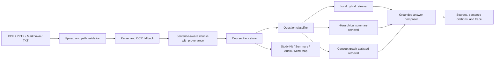

# CourseBee v2 Architecture

CourseBee groups multiple lecture documents into one source-grounded `Course Pack`. The local runtime is intentionally deterministic and dependency-light; production replacements are kept behind explicit provider and storage boundaries.

## Request Flow



## Runtime Layers

| Layer | Current implementation | Production boundary |
| --- | --- | --- |
| API | FastAPI routes and Pydantic schemas | Gateway, identity, tenant authorization |
| Ingest | PyMuPDF, PPTX XML, text parser, Tesseract fallback | Managed parser/OCR worker |
| Retrieval | TF-IDF-style lexical score plus Korean character features | Embedding/vector DB and reranker |
| Routing | Deterministic question classifier | Learned or LLM-assisted router |
| Graph | Evidence-backed concept graph built from pack chunks | Persisted graph index or graph database |
| Generation | Rule/mock API default; demo chat opts into local Ollama Qwen3 | Hosted model with quotas and token telemetry |
| Storage | Atomic JSON and artifact files | Object storage plus durable metadata DB |
| Jobs | File-backed state and FastAPI background tasks | Queue and independent workers |

## Module Boundaries

- `ingest.py`: parser selection, OCR fallback, and document artifacts
- `rag/chunking.py`: sentence-aware chunks and character offsets
- `rag/retrieval.py`: local hybrid retrieval and OCR text normalization
- `providers/semantic.py`: lazy bi-encoder loading, embedding cache, RRF fusion, and Cross-Encoder reranking
- `retrieval_router.py`: fact, relation, overview, and learning-path routing
- `graph/concept_map.py`: concept nodes, relations, and evidence metadata
- `course_packs.py`: Course Pack orchestration and retrieval composition
- `course_pack_store.py`: Course Pack paths, metadata, and chunk loading
- `course_pack_artifacts.py`: artifact persistence, previews, and concept-map export
- `course_pack_jobs.py`: ingestion job lifecycle and progress
- `api/routes.py`: HTTP boundary and response contracts

## Provenance Contract

Every retrievable chunk preserves:

```json
{
  "doc_id": "sha256-document-id",
  "filename": "lecture-01.pdf",
  "pack_id": "pack_course_01",
  "page": 3,
  "chunk_id": "p3_c2",
  "char_start": 1200,
  "char_end": 1800
}
```

Answers return source references with bounded evidence excerpts, sentence-level citation mappings, route information, and a trace containing stage latency and retrieval counts. Graph edges also retain the chunk evidence that created them.

The demo chat uses a three-stage grounded-first policy with local `qwen3:14b`: Course Pack evidence produces `course_pack/grounded`; a Course Pack miss can search bounded Wikipedia extracts and produce `external_web/web_grounded` with original URLs; only a web failure or no-result response can produce `general_knowledge/ungrounded`. The generic API request default remains `mock`, with both fallback layers opt-in, so tests and lightweight deployments do not require Ollama or outbound network access.

The center chat keeps chronological turns in the client and sends a bounded `conversation_history`. Follow-up detection builds a standalone retrieval query from the previous user topic while the generation prompt receives the recent dialogue. `/v2/course-packs/ask/stream` exposes retrieval status, Ollama token events, and the final citation payload over SSE; client disconnects propagate a cancellation signal to the provider. Web extracts are capped, plain-text only, restricted to the configured provider, checked for common prompt-injection markers, and treated as untrusted reference content by the LLM prompt.

Explicit semantic modes add `retrieval_details` containing the embedding/reranker models, lexical and dense candidate counts, reranking status, and fallback usage. The default router remains dependency-free and does not download models implicitly.

## Persistence Layout

```text
outputs/
|-- {doc_id}/
|   |-- document.json
|   |-- pages.json
|   |-- chunks.json
|   `-- graph.json
|-- course_packs/{pack_id}/
|   |-- course_pack.json
|   |-- chunks.json
|   |-- hierarchical_summary_index.json
|   |-- graph.json
|   |-- answers/
|   `-- generated artifacts
`-- course_pack_jobs/{job_id}.json
```

The local file system is a reproducible portfolio implementation, not a durability claim. The production replacement is object storage for files and a database for Course Pack and job metadata.

## Reliability Checks

- atomic artifact replacement
- path and identifier confinement
- per-file upload limits
- optional API-key boundary
- request IDs and stage latency trace
- no-context abstention
- source recall, precision, graph evidence, OCR-noise, conflict, and distractor evaluations

See [Production Readiness](PRODUCTION_READINESS.md) for the intentionally unimplemented production boundaries.
