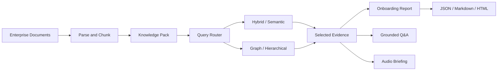
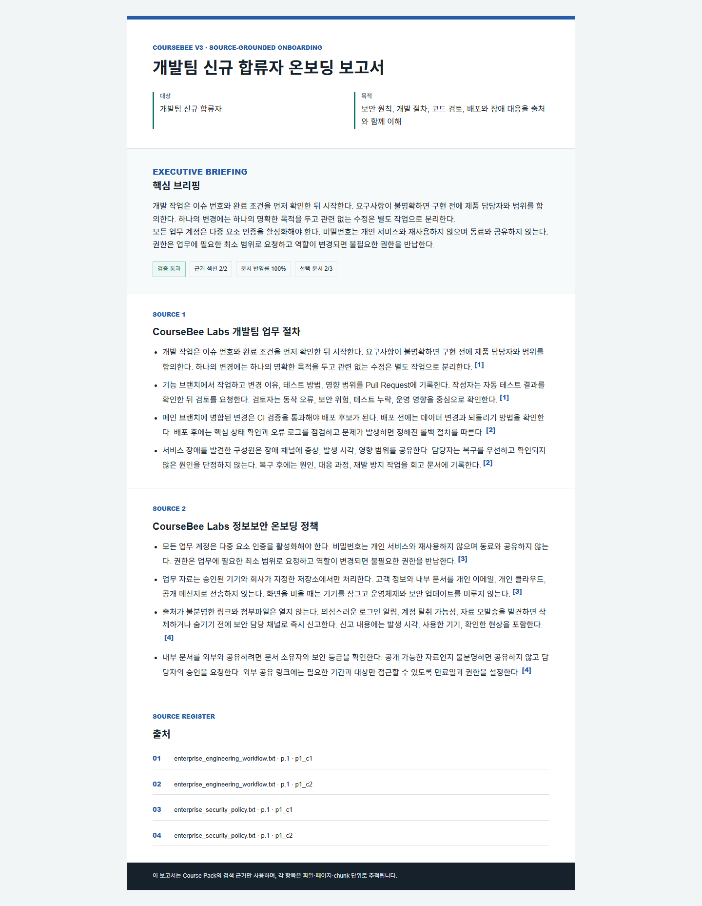

# CourseBee v3: 기업 온보딩 지식 자동화

## 한 줄 정의

CourseBee v3는 흩어진 사내 문서를 하나의 Knowledge Pack으로 구성하고, 같은 검색 근거로 **온보딩 보고서, 질의응답, 오디오 브리핑**을 생성하는 local-first 지식 자동화 서비스다.


## 왜 교육 서비스에서 기업 온보딩으로 확장했나

기존 CourseBee는 여러 강의자료를 묶어 검색하고 오디오로 변환하는 데 강점이 있었다. 그러나 오디오만 전면에 두면 “왜 꼭 들어야 하는가”라는 제품적 질문에 답하기 어려웠다. 기업 온보딩에서는 인사 규정, 보안 정책, 직무 절차를 반복해서 정리하고 개정 때마다 다시 확인해야 하므로 다중 문서 RAG와 출처 추적이 직접적인 업무 가치로 이어진다.

v3는 보고서를 기본 산출물로 두고 오디오를 선택형 소비 채널로 재정의했다.


```text
사내 문서
→ Knowledge Pack
→ 검색·라우팅·근거 선택
→ 온보딩 보고서(기본)
→ Q&A / 오디오 브리핑(상황별 보조 채널)
```

이 구조라면 같은 기반 기술을 신규 입사자 안내뿐 아니라 보안 교육, 직무 전환, 프로젝트 인수인계, 규정 개정 브리핑으로 확장할 수 있다.

## 해결하려는 문제

1. 자료가 여러 파일에 흩어져 필요한 규정을 찾기 어렵다.
2. 교육 담당자가 대상별 안내 자료를 반복해서 작성한다.
3. 일반 LLM이 내부 문서에 없는 절차를 실제 정책처럼 생성할 수 있다.
4. 원문이 바뀌어도 기존 보고서의 어느 부분을 다시 확인해야 하는지 알기 어렵다.
5. 보고서와 오디오가 별도 파이프라인이면 같은 질문에도 내용과 출처가 달라질 수 있다.

## 제품 범위

v3 공개 화면은 완성도가 검증된 세 가지 흐름에 집중한다.

| 기능 | 역할 | 근거 표현 |
| --- | --- | --- |
| Knowledge Sources | PDF, PPTX, Markdown, TXT 누적 | 문서·페이지·chunk metadata |
| Grounded Q&A | 사내 문서 질문과 명시적 폴백 | 문장별 출처와 retrieval trace |
| Onboarding Report | 대상·목적별 핵심 내용 정리 | 섹션별 출처, source register, 검증 지표 |
| Audio Briefing | 이동 중 소비하는 선택형 채널 | 발화별 grounding 검사와 교정 |

퀴즈, 플래시카드, 마인드맵은 기존 API 호환을 위해 남겼지만 v3 UI에서는 숨겼다. 기능 수보다 핵심 흐름의 완성도를 우선한 결정이다.

## 핵심 설계 1: 하나의 근거 모델

문서를 chunk로 나눌 때 `doc_id`, `filename`, `page`, `chunk_id`를 보존한다. 검색 결과를 답변, 보고서, 오디오가 공통으로 사용하므로 산출물이 달라도 원문까지 같은 방식으로 추적할 수 있다.



보고서 섹션과 오디오 발화가 grounding check를 통과하지 못하면 LLM 결과를 그대로 확정하지 않고 source-grounded 결과로 복구한다.

## 핵심 설계 2: 보고서를 검증 가능한 데이터로 만들기

보고서는 화면용 문자열 하나가 아니라 구조화된 artifact다.

- `executive_summary`: 대상과 목적에 맞춘 핵심 브리핑
- `selection`: 전체 문서 수, 목적에 따라 선택된 문서 수와 파일 목록
- `sections`: 문서별 핵심 포인트, 출처, grounding 결과
- `source_register`: 보고서가 사용한 파일·페이지·chunk 목록
- `quality`: 근거 섹션 수, 인용 포함률, 문서 반영률
- `generation`: 전체 또는 증분 생성 여부와 재사용 섹션 수
- `artifacts`: JSON, Markdown, 인쇄 가능한 HTML 경로

전체 개요 요청은 모든 문서를 사용하고, 직무·정책별 요청은 검색 결과와 문서 제목을 함께 사용해 관련 문서만 선택한다. LLM은 executive summary의 문체를 다듬는 데 사용할 수 있지만, 결과가 근거 검사를 통과할 때만 채택된다. Ollama나 API가 없어도 규칙 기반 보고서가 생성되므로 데모와 평가를 재현할 수 있다.



## 핵심 설계 3: 문서 변경 영향 추적과 증분 갱신

사내 문서는 계속 개정된다. 단순 RAG 데모라면 문서를 다시 넣고 결과를 전부 생성하면 끝이지만, 실제 업무에서는 “무엇이 바뀌었고 어느 산출물을 다시 봐야 하는가”가 중요하다.

CourseBee는 문서별 chunk 내용으로 fingerprint를 만들고 보고서 생성 당시의 source snapshot을 저장한다. 이후 현재 snapshot과 비교해 다음 정보를 반환한다.

- 추가, 수정, 삭제된 문서
- 변경 영향을 받은 보고서 섹션
- executive summary 재검토 필요 여부
- 변경되지 않은 문서와 섹션 수

보고서를 다시 만들 때 대상과 목적이 같다면 변경되지 않은 섹션은 재사용하고 영향받은 섹션만 새로 생성한다. 현재 구현은 로컬 file-backed 방식이지만, 이 계약은 향후 Object Storage, DB, durable worker로 옮겨도 유지할 수 있다.

관련 API:

```text
POST /v3/course-packs/onboarding-report
GET  /v3/course-packs/{pack_id}/onboarding-report-impact
```

기존 `/v2/*` API는 하위 호환을 위해 유지한다.

## 검색과 폴백

질문 유형에 따라 local hybrid, multilingual E5, RRF, Cross-Encoder, concept graph, hierarchical summary 경로를 선택한다. Knowledge Pack에서 충분한 근거를 찾지 못하면 다음 순서를 사용한다.

```text
Course Pack 근거
→ 인용 가능한 웹 근거
→ 일반지식 답변
```

일반지식 답변은 자료 기반 답변처럼 위장하지 않는다. `answer_scope`와 `grounding_status`로 범위를 구분하고 “현재 자료에서는 확인할 수 없지만”이라는 상태를 화면에 표시한다.

## 검증 결과

공개 synthetic 기업 문서와 고정 평가 데이터를 사용한다.

| 항목 | 결과 |
| --- | ---: |
| 온보딩 보고서 시나리오 | 3 / 3 |
| 근거 검사를 통과한 보고서 섹션 | 6 / 6 |
| 목적별 출처 선택 recall·precision | 3 / 3 |
| 보고서 인용 포함률 | 1.00 |
| 보고서 문서 반영률 | 1.00 |
| 원문 변경 영향·증분 갱신 검사 | 4 / 4 |
| 오디오 grounding 분류 | 6 / 6 |
| 기본 retrieval router | 10 / 10 |
| 필수 출처 recall | 9 / 9 |
| 브라우저 desktop/mobile 흐름 | 통과 |

수치는 운영 SLA가 아니라 고정 fixture에 대한 회귀 검증 결과다. 실제 기업 문서에서는 권한, 최신성, 문서 충돌 정책을 별도로 설계해야 한다.

## 현재 경계

현재 저장소는 **production-shaped, not production-deployed** 상태다.

| 현재 구현 | 운영 확장 |
| --- | --- |
| 프로세스 내부 semantic index | Vector DB와 분산 cache |
| 로컬 JSON과 파일 artifact | 관계형 DB와 Object Storage |
| FastAPI background task | durable queue와 worker |
| 선택적 API key | 사용자·조직·문서별 권한 |
| 요청 trace | 중앙 로그, metric, OpenTelemetry |

외부 Vector DB를 아직 사용하지 않는 이유는 작은 local-first 데모에서 인프라 이름만 추가하는 것보다 검색 성능과 근거 품질을 먼저 측정하기 위해서다. 문서 규모, 동시성, 다중 인스턴스 요구가 생길 때 현재 provider와 storage 경계를 교체한다.

## 포트폴리오에서 설명할 핵심

CourseBee v3의 중심은 “RAG를 사용했다”가 아니다.

1. 오디오 중심 기술 데모를 실제 업무 산출물 중심 제품으로 재정의했다.
2. 답변, 보고서, 오디오가 하나의 provenance 계약을 공유하게 만들었다.
3. LLM 출력을 그대로 신뢰하지 않고 근거 검사와 deterministic fallback을 적용했다.
4. 문서 개정 시 변경 영향과 증분 갱신까지 설계해 운영 문제로 확장했다.
5. 구현 기술과 미래 기술을 구분하고 자동화된 평가로 현재 수준을 증명했다.
